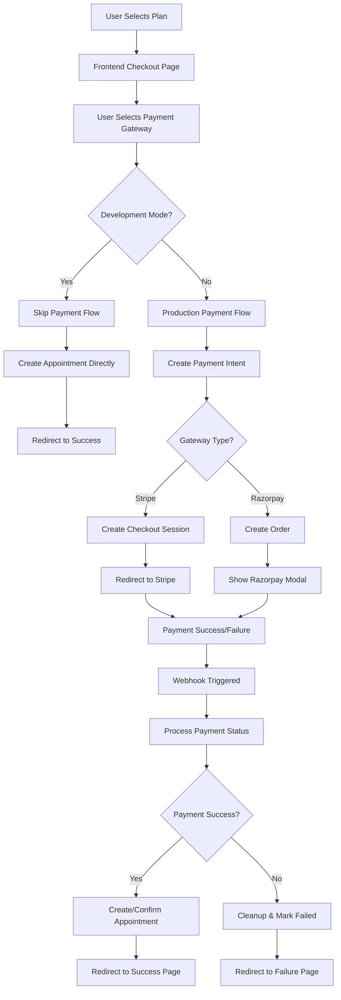
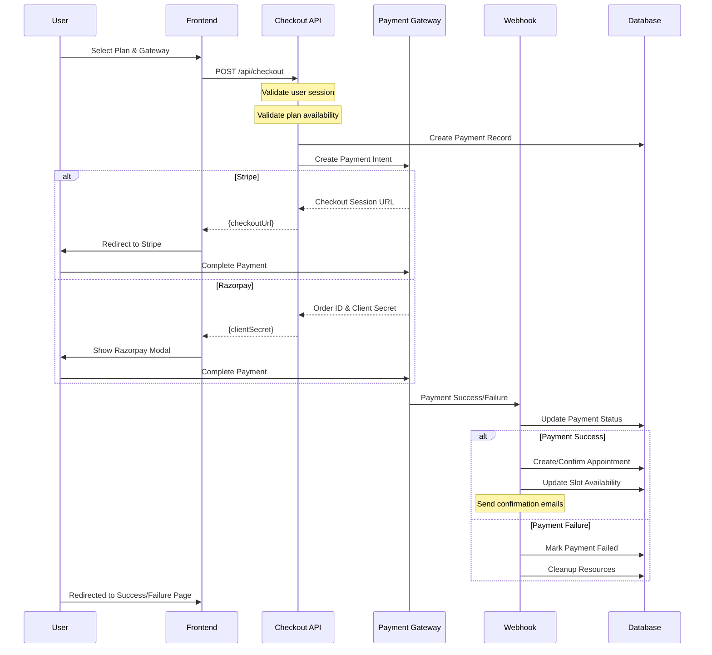
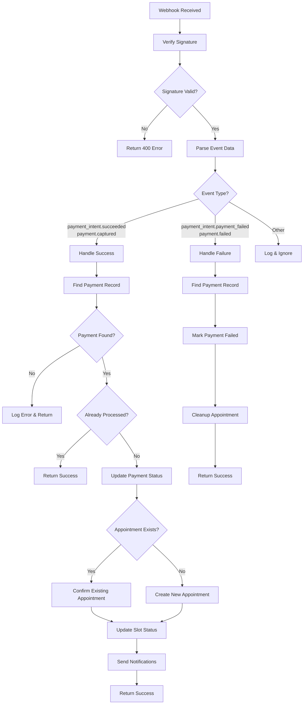

# Familiarize Payment System Documentation

## Overview

The Familiarize platform implements a comprehensive payment system that supports multiple payment gateways (Stripe and Razorpay) for various appointment types including consultations, subscriptions, webinars, and classes. The system is designed with production-ready error handling, webhook processing, and proper database state management.

## Architecture Components

### 1. Frontend Components

- **StripeCheckout.tsx**: Handles Stripe payment processing with @stripe/stripe-js
- **RazorpayCheckout.tsx**: Manages Razorpay payment flows
- **Checkout Pages**: Type-specific checkout flows for different appointment types
- **Utils**: Centralized utility functions for common checkout operations

### 2. API Routes

- **`/api/checkout`**: Main checkout endpoint that orchestrates payment creation
- **`/api/webhooks/stripe`**: Handles Stripe payment confirmation webhooks
- **`/api/webhooks/razorpay`**: Processes Razorpay payment notifications

### 3. Core Libraries

- **`lib/payment.ts`**: Payment gateway abstraction layer
- **`utils/payments.ts`**: Business logic for appointment creation and validation
- **`app/api/webhooks/utils.ts`**: Shared webhook processing utilities

## Payment Flow Architecture

### Development vs Production Flow

The system supports two distinct flows:

1. **Development Flow** (`SKIP_PAYMENT=true`):
   - Creates appointments immediately without payment
   - Used for testing and development

2. **Production Flow** (`SKIP_PAYMENT=false`):
   - Creates payment intent first
   - Creates appointment only after webhook confirmation
   - Proper error handling and rollback mechanisms

## Detailed Flow Diagrams

### 1. Main Checkout Flow



### 2. Payment Gateway Integration Sequence



### 3. Webhook Processing Flow



## Component Details

### Frontend Components

#### StripeCheckout Component

```typescript
interface CheckoutInput {
  appointmentType: AppointmentsType;
  planId: string;
  eventId?: string;
  slotStartTimeInUTC?: string;
  slotEndTimeInUTC?: string;
  notes?: string;
  paymentGateway: PaymentGateway;
  slotOfAvailabilityWeeklyId?: string;
}
```

**Key Features:**

- Loads Stripe.js dynamically
- Handles both Payment Intents and Checkout Sessions
- Implements proper error handling with toast notifications
- Supports development mode with skip payment option
- Validates API responses using Zod schemas

#### RazorpayCheckout Component

**Key Features:**

- Loads Razorpay SDK dynamically
- Handles payment modal display
- Implements proper error handling
- Supports prefill data for better UX
- Manages payment success/failure callbacks

### API Endpoints

#### POST /api/checkout

**Responsibilities:**

- Session authentication validation
- Request body validation using Zod schemas
- Route to development or production flow
- Error handling with specific error types

**Request Schema:**

```typescript
const checkoutSchema = z.object({
  appointmentType: z.enum(["CONSULTATION", "SUBSCRIPTION", "WEBINAR", "CLASS"]),
  planId: z.string().min(1, "Plan ID is required"),
  eventId: z.string().optional(),
  slotStartTimeInUTC: z.string().optional(),
  slotEndTimeInUTC: z.string().optional(),
  notes: z.string().optional(),
  paymentGateway: z.enum([
    "STRIPE",
    "RAZORPAY",
    "LEMON_SQUEEZY",
    "XFLOW",
    "CARD",
  ]),
  slotOfAvailabilityWeeklyId: z.string().optional(),
});
```

**Response Types:**

```typescript
// Development Response
{
  success: true,
  appointmentId: string,
  message: string
}

// Production Response
{
  checkoutUrl?: string,      // For Stripe Checkout Sessions
  clientSecret?: string,     // For Razorpay Orders
  paymentIntentId: string,
  requiresAction?: boolean
}
```

#### POST /api/webhooks/stripe

**Supported Events:**

- `payment_intent.succeeded`: Payment completed successfully
- `payment_intent.payment_failed`: Payment failed

**Security:**

- Verifies webhook signature using Stripe's SDK
- Validates event schema using Zod
- Implements idempotency to prevent duplicate processing

#### POST /api/webhooks/razorpay

**Supported Events:**

- `payment.captured`: Payment captured successfully
- `order.paid`: Order payment completed
- `payment.failed`: Payment failed

**Security:**

- Verifies webhook signature using HMAC SHA256
- Validates event schema using Zod
- Implements idempotency to prevent duplicate processing

### Core Business Logic

#### Payment Intent Management

The `PaymentIntentManager` class provides:

- **Intent Creation**: Creates payment intents with proper metadata
- **Cleanup**: Cancels payment intents on database failures
- **Tracking**: Maintains active intents for potential cleanup

#### Appointment Creation Logic

```typescript
// Supports multiple appointment types
switch (appointmentType) {
  case "CONSULTATION":
    // Creates consultation with slot validation
    break;
  case "SUBSCRIPTION":
    // Creates subscription with recurring logic
    break;
  case "WEBINAR":
    // Joins existing webinar event
    break;
  case "CLASS":
    // Joins existing class event
    break;
}
```

#### Slot Availability Validation

- Validates time slot conflicts
- Checks consultant availability
- Prevents double booking
- Handles timezone conversions

## Database Schema Integration

### Payment Table

```sql
model Payment {
  id                String         @id @default(cuid())
  paymentIntent     String         @unique
  paymentGateway    PaymentGateway
  paymentStatus     PaymentStatus  @default(PENDING)
  amount            Float
  currency          String         @default("USD")
  userId            String
  appointmentId     String?
  createdAt         DateTime       @default(now())
  updatedAt         DateTime       @updatedAt
}
```

### Appointment State Management

- **PENDING**: Appointment created, awaiting payment
- **CONFIRMED**: Payment successful, appointment confirmed
- **CANCELLED**: Payment failed or appointment cancelled

## Error Handling Strategy

### Error Types

1. **Authentication Errors**: Invalid API keys, session issues
2. **Validation Errors**: Invalid request data, missing fields
3. **Business Logic Errors**: Slot unavailable, plan not found
4. **Payment Gateway Errors**: Gateway-specific failures
5. **Database Errors**: Transaction failures, connection issues

### Error Recovery

- **Payment Intent Cleanup**: Automatic cancellation on database failures
- **Webhook Idempotency**: Prevents duplicate processing
- **Transaction Rollback**: Ensures data consistency
- **User Notification**: Clear error messages with recovery options

## Configuration

### Environment Variables

```env
# Payment Gateways
STRIPE_SECRET_KEY=sk_test_...
STRIPE_PUBLISHABLE_KEY=pk_test_...
STRIPE_WEBHOOK_SECRET=whsec_...

RAZORPAY_KEY_ID=rzp_test_...
RAZORPAY_SECRET=...
RAZORPAY_WEBHOOK_SECRET=...

# Application
NEXT_PUBLIC_APP_URL=http://localhost:3000
SKIP_PAYMENT=false  # Set to true for development
```

### Security Best Practices

1. **Webhook Signature Verification**: All webhooks verify signatures
2. **Environment Separation**: Separate keys for test/production
3. **Secure Metadata**: Sensitive data not stored in payment metadata
4. **Transaction Integrity**: Database transactions ensure consistency
5. **Idempotency**: Webhook processing prevents duplicate operations

## Testing Strategy

### Development Mode

- Set `SKIP_PAYMENT=true` to bypass payment processing
- Creates appointments directly for testing flows
- Maintains all business logic validation

### Production Testing

- Use test API keys for both Stripe and Razorpay
- Test webhook endpoints using ngrok or similar tools
- Verify error handling with invalid data
- Test concurrent payment scenarios

## Monitoring and Observability

### Logging Strategy

- Payment intent creation/cancellation
- Webhook event processing
- Error conditions with context
- Performance metrics for database transactions

### Health Checks

- Payment gateway connectivity
- Webhook endpoint availability
- Database connection status
- Critical error alerting

## Future Enhancements

### Planned Features

1. **Additional Payment Gateways**: Lemon Squeezy, XFlow integration
2. **Recurring Payments**: Automatic subscription renewals
3. **Partial Refunds**: Pro-rated cancellation handling
4. **Payment Analytics**: Revenue tracking and reporting
5. **Multi-currency Support**: Dynamic currency conversion

### Scalability Considerations

- Database connection pooling
- Webhook processing queue
- Payment intent cleanup jobs
- Cache optimization for plan lookups

---

_This documentation provides a comprehensive overview of the Familiarize payment system. For implementation details, refer to the individual component files and API route handlers._
